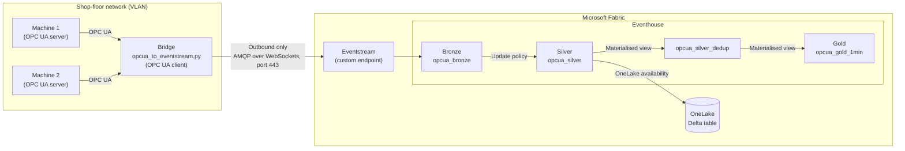

# OPC UA to Microsoft Fabric Real-Time Intelligence (sample)

Stream shop-floor machine data from **OPC UA** servers into **Microsoft Fabric Real-Time Intelligence**
through an **Eventstream custom endpoint**, then shape it into bronze, silver and gold layers in an
**Eventhouse**.

> **Sample code.** Provided as-is under the [MIT License](LICENSE) for learning and prototyping.
> This is **not an official Microsoft product or sample**, it isn't supported, and it isn't
> production-hardened. Review security, reliability and monitoring before production use.

## How it works



* The bridge runs on a small PC or VM **inside** the machine network. It opens connections
  **outbound only**: OPC UA to the machines, and port 443 to Fabric. No inbound firewall rules are needed.
* Each OPC UA value change becomes one JSON event, tagged with `machineId` and an optional `runId`
  so telemetry can be joined with experiment (DOE) runs and specimens later.
* If Fabric can't be reached, events are kept in a local file and resent later. OPC UA sessions
  reconnect automatically.
* The core "send to Fabric" part is short (`open_producer` and `send_events`, about 40 lines). The rest
  of the script is resilience: reconnects, batching and store-and-forward.

## Repository contents

| Path | Purpose |
|---|---|
| `src/opcua_to_eventstream.py` | The bridge (command-line tool and importable module) |
| `notebooks/01_opcua_to_fabric_eventstream.ipynb` | Step-by-step walkthrough: connect, browse tags, send a test event, stream, verify |
| `kql/medallion.kql` | Bronze, silver and gold tables, update policy, materialised views, OneLake availability |
| `kql/verify.kql` | Queries to check that data is arriving |
| `config/machines.example.json` | Example configuration for several machines |
| `.env.example` | All settings, with explanations |
| `docker-compose.yml` | OPC PLC simulator for local testing (pinned version) |
| `requirements.txt`, `requirements-dev.txt` | Python packages (runtime, and test tools) |
| `tests/` | Unit tests, plus integration tests against the OPC PLC simulator |
| `.github/workflows/ci.yml` | GitHub Actions: tests and a command-line smoke test against the simulator |

## Prerequisites

* Python 3.10 or later on the bridge PC/VM. Outbound HTTPS (443) to `*.servicebus.windows.net`
  is required, plus `login.microsoftonline.com` if you use Microsoft Entra ID.
* A Fabric workspace on Fabric capacity (not *My workspace*), with Contributor access or higher.
* For testing without machines: Docker, to run the
  [OPC PLC simulator](https://github.com/Azure-Samples/iot-edge-opc-plc).

## Quick start (about 15 minutes)

### 1. Set up Fabric (one-off)

1. In your workspace, create an **Eventhouse**. In its KQL database, run `kql/medallion.kql` one
   command at a time.
2. Create an **Eventstream**, choose **Add source > Custom endpoint**, then select **Publish**.
   The connection details only appear after you publish.
3. Select the custom endpoint tile and open **Details > Event Hub > SAS Key Authentication**.
   Copy **Connection string-primary key**.
4. Choose **Add destination > Eventhouse** with **Event processing before ingestion**. Select your
   KQL database and the existing table `opcua_bronze`, set the input data format to **JSON**, then
   select **Publish**.

### 2. Run the bridge

```bash
git clone <this-repo> && cd opcua-to-fabric-rti
python -m venv .venv && source .venv/bin/activate      # Windows: .venv\Scripts\activate
pip install -r requirements.txt
cp .env.example .env                                   # then paste the connection string into .env

docker compose up -d                                   # optional: start the OPC PLC simulator

python src/opcua_to_eventstream.py --browse            # list variables and their NodeIds
python src/opcua_to_eventstream.py --dry-run --duration 30   # test OPC UA only (prints events)
python src/opcua_to_eventstream.py                     # stream to Fabric (Ctrl+C to stop)
```

`--browse` lists up to 1,000 variables from the Objects folder. Nodes you aren't allowed to read
show as `<unreadable>`. To list part of the address space, start from a NodeId, for example the
simulator's tags:

```bash
python src/opcua_to_eventstream.py --browse --browse-root "ns=3;s=OpcPlc"
```

### 3. Check the data

Open the Eventstream's live view, then run the queries in `kql/verify.kql` in the Eventhouse.
With **Event processing before ingestion**, expect rows in `opcua_bronze` about 10-60 seconds after
the bridge sends them.

Prefer a guided version? Open `notebooks/01_opcua_to_fabric_eventstream.ipynb` in VS Code or Jupyter
**on the bridge PC**. It must run where it can reach the machines, so it won't work from a Fabric notebook.

## Configuration

Set values in `.env` (see `.env.example`) or as environment variables. Environment variables take
precedence over `.env`.

| Setting | Description |
|---|---|
| `OPCUA_URL`, `MACHINE_ID`, `NODE_MAP_JSON` | One machine: endpoint, ID and `{"NodeId": "TagName"}` map. If the map is empty, the simulator defaults are used |
| `MACHINES_FILE` | Several machines: path to a JSON file (see `config/machines.example.json`). Secrets are referenced by environment-variable name (`usernameEnv`, `passwordEnv`) |
| `OPCUA_USER`, `OPCUA_PASSWORD` | Optional OPC UA username and password |
| `OPCUA_SECURITY` | Optional `Policy,Mode,client_cert,client_key[,server_cert]`, e.g. `Basic256Sha256,SignAndEncrypt,certs/client_cert.der,certs/client_key.pem,certs/server_cert.der` |
| `PUBLISHING_INTERVAL_MS` | How often the server sends changes (default 1000) |
| `SAMPLING_INTERVAL_MS`, `MONITORED_QUEUE_SIZE` | How often each tag is sampled (default: the publishing interval) and how many values are kept per tag between publishes (default 1). See [Sampling and data fidelity](#sampling-and-data-fidelity) |
| `RUN_ID` | Experiment or run ID added to every event |
| `EVENTSTREAM_CONNECTION_STRING` | SAS connection string (quick start) |
| `EVENTSTREAM_NAMESPACE`, `EVENTSTREAM_HUB`, `AZURE_CLIENT_ID`, `AZURE_TENANT_ID`, `AZURE_CLIENT_SECRET` | Microsoft Entra ID sign-in (recommended for production) |
| `USE_WEBSOCKETS` | `true` uses port 443; `false` uses AMQP port 5671 |
| `SEND_RETRIES` | Retries per send before events go to the spool file (default 3) |
| `BATCH_WINDOW_S`, `MAX_BATCH_EVENTS` | How long to collect events before sending, and the maximum per batch |
| `QUEUE_SIZE` | In-memory buffer between OPC UA and the sender (events) |
| `SPOOL_FILE`, `SPOOL_MAX_MB` | Local store-and-forward file and its size limit |

In `machines.json`, the per-machine keys are `machineId`, `endpoint`, `nodes`, `publishingIntervalMs`,
`samplingIntervalMs`, `queueSize`, `security`, `usernameEnv` and `passwordEnv`.

### Event format

```json
{
  "machineId": "machine-01",
  "runId": "DOE-2026-10-06-R01",
  "gatewayId": "bridge-pc-01",
  "nodeId": "ns=3;s=SpikeData",
  "tag": "Temperature",
  "value": 87.4,
  "statusGood": true,
  "sourceTimestamp": "2026-10-06T03:15:02.123000+00:00",
  "ingestTimestamp": "2026-10-06T03:15:02.456000+00:00"
}
```

`value` keeps its OPC UA type (number, boolean or text) in the bronze `dynamic` column. Silver adds
`valueNum` (booleans become 1/0) and `valueText`.

### Sampling and data fidelity

The server samples each tag every `SAMPLING_INTERVAL_MS` and sends changes every
`PUBLISHING_INTERVAL_MS`. With the default queue size of 1, only the **latest** value per tag in
each publishing interval is sent. To keep every sample, for example of a fast sensor, set
`MONITORED_QUEUE_SIZE` to at least `PUBLISHING_INTERVAL_MS / SAMPLING_INTERVAL_MS`
(e.g. 100 ms sampling, 1000 ms publishing and queue size 10). The server may revise these values.

### Store and forward

* If a send fails (after `SEND_RETRIES`), the batch is written to `SPOOL_FILE` and new events go
  straight to the file for 30 seconds, so a Fabric outage doesn't slow down reading the machines.
* When sends succeed again, or when the bridge is idle, spooled events are resent in chunks of 5,000
  between live batches. The file is deleted once everything has been sent.
* Lines that can't be read (for example after a power cut mid-write) are skipped and logged.
* Events can be sent twice after a partial failure or a restart. `opcua_silver_dedup` removes these
  duplicates.

## OneLake and the medallion layers

* `kql/medallion.kql` turns on OneLake availability for the **`opcua_silver` table**, which then
  appears in OneLake as a Delta table. Writes are batched; the script sets the minimum delay of
  5 minutes (the default is up to 3 hours).
* **Materialised views aren't written to OneLake.** The mirroring policy applies to tables only, so
  `opcua_silver_dedup` and `opcua_gold_1min` are available through KQL: a KQL queryset, Real-Time
  dashboards, Fabric data agents, or the Kusto REST API and SDKs.
* Readers of the OneLake copy of `opcua_silver` (Lakehouse shortcuts, Spark, the SQL analytics endpoint,
  Power BI Direct Lake) should remove duplicates themselves, keeping one row per
  `machineId, tag, sourceTimestamp`.
* If you need gold data in OneLake, write it to a **table** (for example, with a scheduled
  `.set-or-append` or a Fabric notebook) and turn on OneLake availability for that table.

## Moving towards production

* **Sign-in.** Anyone with the SAS connection string can send data, so store it securely and rotate
  it. For production, use Microsoft Entra ID:
  1. Create an app registration and give it the **Contributor** role on the workspace.
  2. Ask your tenant admin to turn on **Service principals can call Fabric public APIs**.
  3. Set `EVENTSTREAM_NAMESPACE` (for example `xxxx.servicebus.windows.net`), `EVENTSTREAM_HUB` and the
     `AZURE_*` values from the custom endpoint's **Entra ID Authentication** tab.

  The bridge uses `DefaultAzureCredential`, so a managed identity or a developer sign-in
  (for example `az login`) also works when the `AZURE_*` values aren't set.
* **OPC UA security.** Use `SignAndEncrypt` with certificates trusted on both sides. Add the
  machine's server certificate as the fifth value of `OPCUA_SECURITY`. Without it, the bridge
  accepts whatever certificate the server presents. Avoid anonymous access and unsecured endpoints
  outside testing.
* **Secrets.** Keep `.env`, certificates and keys out of Git (see `.gitignore`). Use a secret store
  where possible.
* **Run as a service**, e.g. with systemd on Linux:

  ```ini
  [Unit]
  Description=OPC UA to Fabric Eventstream bridge
  After=network-online.target

  [Service]
  WorkingDirectory=/opt/opcua-to-fabric-rti
  ExecStart=/opt/opcua-to-fabric-rti/.venv/bin/python src/opcua_to_eventstream.py --env-file /opt/opcua-to-fabric-rti/.env
  Restart=always
  RestartSec=10
  User=opcbridge

  [Install]
  WantedBy=multi-user.target
  ```

  On Windows, use a service wrapper or Task Scheduler.
* **Monitoring.** Watch the logs for "Send failed", "Spool file is full", "Skipped ... unreadable"
  and "queue full" messages, and use Eventstream and Eventhouse monitoring in Fabric.
* **Scale.** One bridge can read several machines (`MACHINES_FILE`). For many machines or sites,
  consider Azure IoT Operations or OPC Publisher on Azure IoT Edge.

## Testing

```bash
pip install -r requirements-dev.txt
pytest                                                    # unit tests (no server needed)

docker compose up -d                                      # OPC PLC simulator
OPCUA_TEST_URL=opc.tcp://localhost:50000 pytest           # plus integration tests
```

The GitHub Actions workflow in `.github/workflows/ci.yml` runs the same tests on Python 3.10 and
3.12, then a `--browse` and `--dry-run` smoke test against the simulator.

**Tested end to end** (October 2026) with asyncua 2.0.1, azure-eventhub 5.15.1, OPC PLC 2.15.9 and
Python 3.13, on a Fabric F-SKU capacity:

* Eventstream custom endpoint to Eventhouse (event processing before ingestion), signing in with the
  SAS key and with Microsoft Entra ID.
* Store-and-forward: events spooled while Fabric was unreachable were replayed with no loss and no
  duplicates.
* `kql/medallion.kql` run on a new database, and the silver table exported to OneLake.

## Troubleshooting

| Symptom | Things to check |
|---|---|
| `BadSecurityChecksFailed` or a certificate error | Trust the bridge certificate on the OPC UA server (and the reverse), and check the security policy and mode |
| `BadNodeIdUnknown` / "Could not subscribe" | NodeIds or the namespace index are wrong. Run `--browse` |
| `--browse` doesn't show your tags | Use `--browse-root <NodeId>` to start lower in the tree, or raise `--max-nodes` |
| Warning "Revised values returned differ from subscription values" | Normal: the server adjusted keep-alive or lifetime counts. No action needed |
| No connection to Fabric | Is outbound 443 to `*.servicebus.windows.net` allowed? Is the Eventstream published? Is the connection string complete (it includes `EntityPath`)? |
| Data in Eventstream but not in the table | Check the Eventhouse destination uses table `opcua_bronze` with JSON input, then publish again |
| `opcua_gold_1min` is missing | It's built on `opcua_silver_dedup`, which must exist first. Run the commands in `kql/medallion.kql` in order |
| `unsent_events.jsonl` keeps growing | Fabric is unreachable or authentication is failing. Check the logs |

## References

* [Add a custom endpoint source to an eventstream](https://learn.microsoft.com/fabric/real-time-intelligence/event-streams/add-source-custom-app)
* [Connect to Eventstream using Microsoft Entra ID authentication](https://learn.microsoft.com/fabric/real-time-intelligence/event-streams/custom-endpoint-entra-id-auth)
* [Medallion architecture in Real-Time Intelligence](https://learn.microsoft.com/fabric/real-time-intelligence/architecture-medallion)
* [Eventhouse OneLake availability](https://learn.microsoft.com/fabric/real-time-intelligence/event-house-onelake-availability)
  and the [mirroring policy](https://learn.microsoft.com/kusto/management/mirroring-policy?view=microsoft-fabric)
* [OPC PLC simulator](https://github.com/Azure-Samples/iot-edge-opc-plc)
* [asyncua (OPC UA for Python)](https://github.com/FreeOpcUa/opcua-asyncio) and
  [azure-eventhub](https://pypi.org/project/azure-eventhub/)

## Licence

This sample is released under the [MIT License](LICENSE). To report a security issue, see
[SECURITY.md](SECURITY.md).

Third-party packages are installed from PyPI and aren't included in this repository. They keep
their own licences: notably, **asyncua is LGPL-3.0**, and the Azure SDK packages are MIT. The OPC PLC
simulator image is published by Microsoft under the MIT License.
